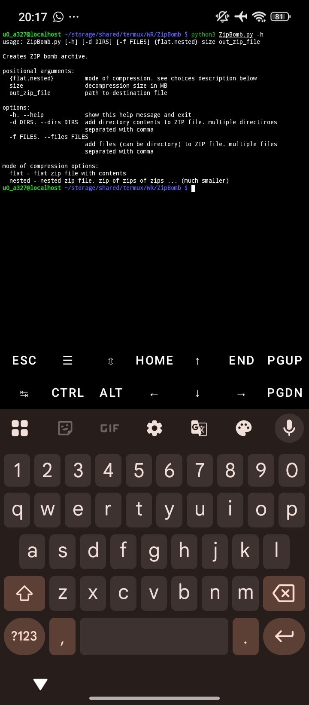
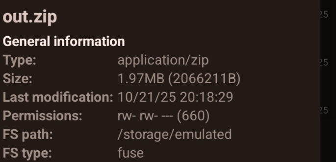
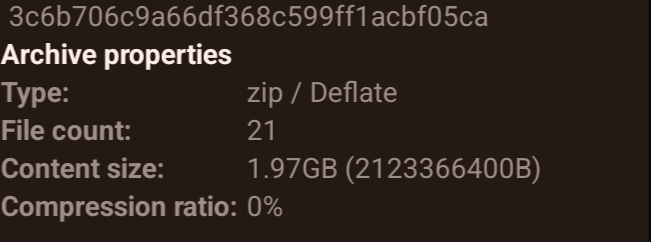

# Zip-Bomb
What is a `Zip bomb`?

In computing, a zip bomb, also known as a decompression bomb or zip of death, is a malicious archive file designed to crash or render useless the program or system reading it.

# ⚠️IMPORTANT
AS THE CREATOR, I AM NOT RESPONSIBLE FOR ANY DAMAGES! PLEASE USE WITH CARE!

## Script Usage
```

python pythonfile.py flat/nested size zipname.zip

```

## Flat Example
```

python ZipBomb.py flat 1024 out.zip

```

## Nested Example
```

python ZipBomb.py nested 1024 out.zip

```

# Preview


## Zip size before extraction (flat)



## Zip size after extraction (flat)


